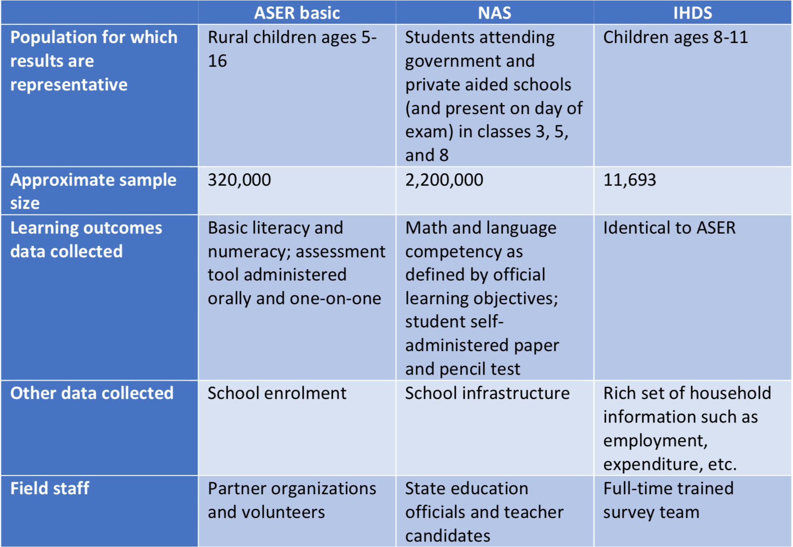

# Sources of Learning Outcomes Data

We first provide a brief background on each of the three learning outcomes surveys, ASER, NAS, and IHDS. In particular, we summarize each survey’s sampling strategy, frequency, test instrument, and implementation.

## Annual State of Education Report (ASER) Survey
The ASER basic survey is a nationally representative survey, conducted every year in its first years and every other year currently, which seeks to assess rural Indian children’s basic literacy and numeracy. The ASER basic survey uses a two stage sampling strategy to select a representative sample of all rural households. In the first stage, 30 villages are selected using probability proportional to size without replacement (where size is defined as the number of households from the census) in each rural district in the country. Urban districts are excluded from the survey. The ASER basic survey employs a rotating panel of villages. Each year, 10 villages are replaced with new villages. In each village, 20 households are selected using the “right-hand rule,” a pseudo-random method for selecting households which does not require a full household listing^[For more details, see
http://www.asercentre.org/Survey/Basic/Pack/Sampling/History/p/Overview/Basic/Pack/History/etc/p/56.html].

ASER surveyors collect data on school enrolment for all children ages 3-16 in selected households. In addition, ASER surveyors administer ASER reading and math assessments to all children ages 5-16. The ASER reading and math assessments are simple tools, conducted orally and one-on-one, designed to assess a child’s basic numeracy and literacy. The ASER reading assessment assigns each child one of five literacy levels: can’t identify letters, can identify letters but not words, can read words but not a paragraph, can read a short paragraph but not story, and can read a longer story (which corresponds to a standard 2 level text). Similarly, the ASER math assessment assigns each child one of five numeracy levels: can’t identify numbers 1-9, can identify numbers 1-9 but not 11- 99, can perform two-digit subtraction but not 3 digit by 1 division, and can perform 3 digit by 1 division.

The entire ASER survey is implemented by a network of partner organizations and volunteers. In many districts, the ASER partner organization is the local District Institute of Educational Training (DIET). As noted below, NAS surveyors are recruited from candidates currently training to be teachers at DIETs.

## National Achievement Survey (NAS)
The National Achievement Survey (NAS) is a large, school-based assessment of student learning conducted by the central government with the help of states. NAS has been conducted every year starting in 2001 but in 2017 was expanded to include children from grades 3, 5, and 8 at the same time (previous rounds typically assessed students from only one of these grades), the sample size was significantly increased so that results would be representative at the district level, and the assessment tool was modified to test student competencies. The central government also announced its intention to repeat this larger NAS in future rounds. For brevity’s sake, we, like most observers, refer to the 2017 NAS as the NAS though there have been several other NAS surveys.

According to the NAS district report, 120,000 government and private-aided schools were selected from official lists for inclusion in NAS using probability proportional to size sampling. Within each school, up to 30 students per class in classes 3, 5, and 8 are randomly selected^[See page 37 of the NAS operational guidelines for more information on random selection of sections and students.]. NAS documentation does not specify how many schools were sampled per district or what measure of size (total number of students or total students in classes 3, 5, 8, and 10) was used. According to the NAS district report, a total of 2.2 million students were assessed in NAS making the NAS one of the largest sample surveys ever conducted^[Details of the NAS sample size vary somewhat by source. According to the forward of the NAS district report card report, 120,000 schools and 2.2 million students were sampled. (See http://www.ncert.nic.in/programmes/NAS/pdf/DRC_report.pdf). But according to the initial press release on the NAS, 1,100,000 schools and 2.5 million students were sampled. (See https://pib.gov.in/newsite/printrelease.aspx?relid=173462)]

The NAS collected a variety of data on schools and students and assessed all students’ language and math ability. (In addition, NAS assessed class 3 and 5 students’ competency in environmental sciences and class 8 students’ competency in science and social science.) The assessment was designed to measure whether students had achieved official learning objectives as specified in the Right to Education Act (as amended in 2017). For example, one learning objective for class 3 language is “reads small texts with comprehension.” NAS does not make public the test questions it uses. Unlike the ASER assessment, the NAS assessment is a paper and pencil self-administered assessment.NAS was designed and supervised by the National Council of Educational Research and Training and implemented by states. Field investigators were selected from among candidates currently training to be government teachers at DIETs to ensure no conflict of interest

## India Human Development Survey (IHDS)

The India Human Development Survey (IHDS) is a large, panel survey representative of all households in India. We use only the second round of IHDS which was conducted in 2011-12. Households were selected using a two-stage sampling strategy^[For more information on the sampling strategy see
https://ihds.umd.edu/sites/default/files/publications/papers/technical%20paper%201.pdf].

HDS collected data on a range of subjects such as consumption expenditure, employment, household assets. IHDS collected data on current enrolment, high grade completed, and other education related variables for all household members. In addition, IHDS orally administered a learning assessment tool based on the ASER assessment tool to all children ages 8-11.

```{r learningoutcomes, fig.align="center", echo=FALSE, fig.cap="Summary of Learning Outcome Surveys", out.width = '80%'}

```


