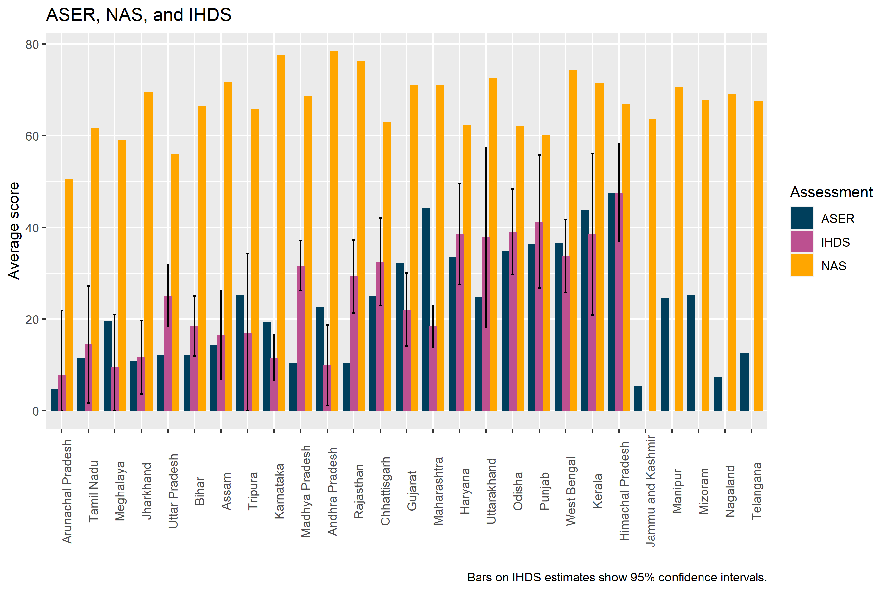
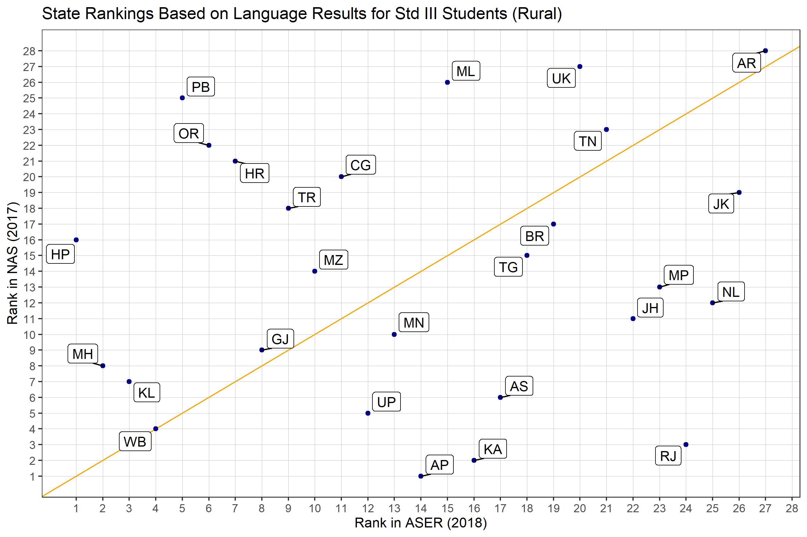
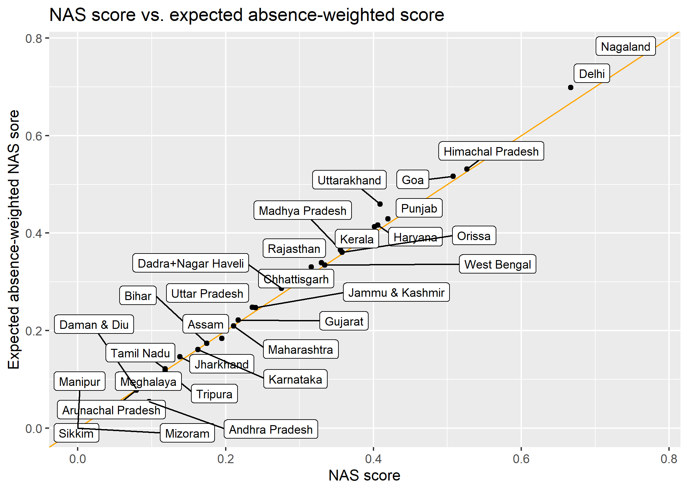

# Results {#results}
Figure \@ref(fig:asernasihds) plots class 3 average language scores for rural, government school students from ASER, NAS, and IHDS. IHDS values are missing from some states due to insufficient sample size. Figure \@ref(fig:correlations) plots the state rank from ASER on the x axis and the state rank from NAS on the y axis. 


```{r asernasihds, fig.align="center", echo=FALSE, fig.cap="ASER, NAS, and IHDS", out.width = '100%'}

```


```{r correlations, fig.align="center", echo=FALSE, fig.cap="Correlation Between ASER and NAS", out.width = '80%'}

```
These figures show that IHDS and ASER state averages are very similar in size and that NAS state averages are much higher and not very correlated with either IHDS or ASER. A formal test for correlation confirms that IHDS and ASER are highly correlated (r = 0.62), and NAS is not at all correlated with IHDS (r = -0.03) and only modestly correlated with ASER (r= 0.19). For comparison, ASER grade 3 state average reading and math scores are highly correlated (r = 0.82) suggesting that differences in the aspect of reading being measured likely accounts for very little of this discrepancy.

In addition, comparing ASER and NAS to net state domestic product reveals that ASER is substantially correlated with NSDP (r = 0.41) while NAS is only modestly correlated with NSDP (r = 0.05). (All correlations are Pearson though Spearman gives similar results.) \textcolor{red}{Why do we care about correlating this with NSDP? We should write about that here and maybe cite other work that has done that. Also, we could add in the appendix the results of the Pearman correlation}

Figure \@ref(fig:weighted) plots state averages from IHDS taking absence into account (y axis) against state averages when absence is not considered (x axis). Most points in the figure lie slightly above the line of equality, revealing that students with higher rates of absence tend to have lower learning outcomes. However, the effect of these absences on overall scores is very small. In only a few cases does taking absence into account shift relative ranking of the state. (Results available on request.) \textcolor{red}{We should either include these results (here or in the appendix) or not mention this bit if it's not important}

```{r weighted, fig.align="center", echo=FALSE, fig.cap="NAS Score vs. Expected Absence Weighted Score", out.width = '80%'}

```