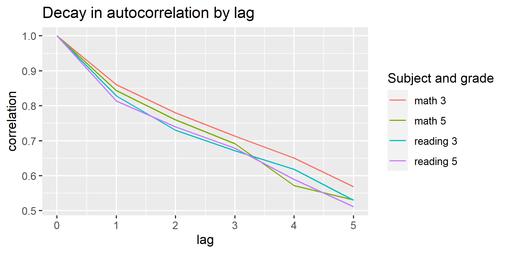
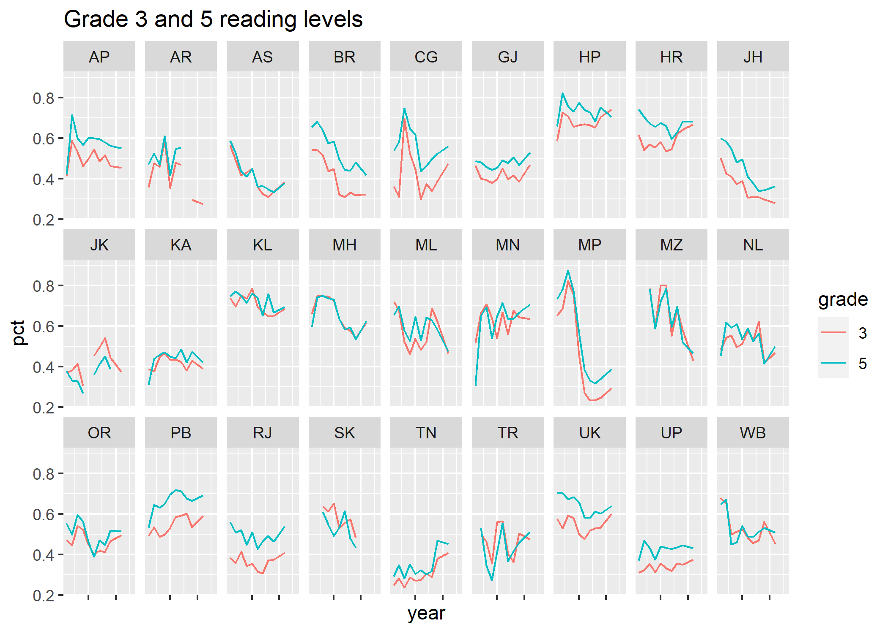
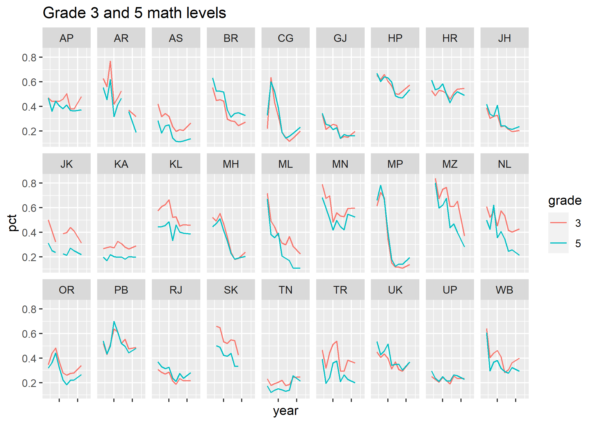
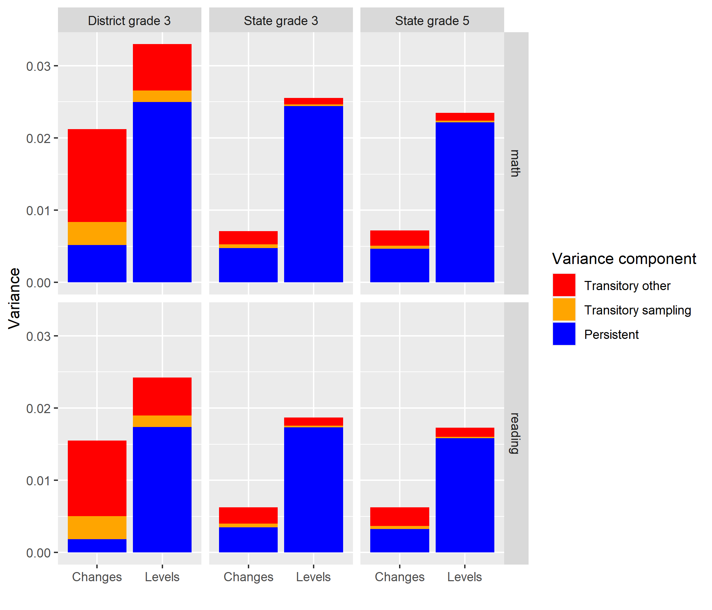

# Assessing ASER’s Reliability

## Overview of Approach

Similarity between ASER and IHDS data provides reassurance in the reliability of ASER state rankings. Yet ASER’s reliance on partner organizations for surveying and the right-hand rule for sampling households generates potential for significant non-sampling errors. For example, if enumerators of a partner organization are slightly more lenient in how they mark the assessment or slightly more likely to survey children who are at home at the time of the survey (as opposed to children determined by the right hand rule).

We analyse the reliability of both ASER scores (i.e. levels) and changes in ASER scores at the state and district level using two approaches adapted from @kane2002promise’s analysis of average school test scores in the US. Kane and Staiger decompose the variance of school average test scores into persistent and transitory components and then further decompose the transitory component into sampling variance and non-sampling variance. Intuitively, this approach looks at whether changes in ASER scores from one round to the next are typically reversed. If changes in scores tend to “stick,” we can be relatively confident that the measured change reflects an actual change in underlying learning outcomes. On the other hand, if changes are typically reversed, we would suspect that the measured change was either due to measurement error or some temporary effect on learning outcomes.

The key assumption underlying this approach is that changes in measured scores which persist reflect true changes in learning outcomes while transitory changes are due to noise. True transitory effects on learning outcomes may arise from two main sources. First, some policy or intervention may cause a temporary increase / decrease in learning outcomes which is reversed in subsequent years. Second, one cohort of students may have higher/lower learning outcomes than cohorts above and below. If this is the case, the round in which those students are tested would show higher/lower learning outcomes.

We are unable to test whether temporary increases in learning outcomes are plausible based purely on data but we find it unlikely based on our understanding of education policy. Education policies are generally for multiple years and rarely are significant changes rolled back after a single year. By contrast, we are able to empirically test whether differences between cohorts are a likely source of transitory changes in ASER scores by looking at whether changes in grade 3 scores predict changes in grade 5 scores two years later.

## Formal Approach
We use two different methods to decompose variance into persistent and transitory components. The first method assumes that average test scores $y_{t}$ for a state or district at time ${t}$ consist of a fixed component $\alpha$, a persistent component $v_{t}$ which follows a random walk, and a transitory component $\epsilon_{i}$ which is i.i.d. so that average test scores equal:

$$ 
\begin{aligned}
y_{t} &= \alpha + v_{t} + \epsilon_{t} \\
where \; v_{t} &= v_{t-1} + u_{t}
\end{aligned}
$$ 

Then, $Var(\Delta y_{t}) = \sigma^2_{u} + 2\sigma^2_{e}$ and the proportion of the overall variance of the changes in $y$ arising due to the transitory shock can be estimated as:
$$
\begin{aligned}
  -2*corr(\Delta y_{t}, \Delta y_{t-1}) &= 
  -2*corr(u_{t} + \epsilon_{t} - \epsilon_{t-1},u_{t-1} + \epsilon_{t-1} - \epsilon_{t-2}) \\
  &= \frac{2\sigma^2_{e}}{\sigma^2_{u} + 2\sigma^2_{e}}
\end{aligned}
$$
Similarly, we can also estimate the proportion of variance in levels (as opposed to changes) which are due to the transitory shock by rearranging the formula above to get:
$$
\sigma^2_{e} = corr(\Delta y_{t}, \Delta y_{t-1}) *Var(\Delta y_{t})
$$

A potential downside to this method is that it relies on the assumption that the $u_{t}$ and $\epsilon_{t}$ terms are not serially correlated. The $u_{t}$ terms may be serially correlated if, for example, states or districts often implement programs which result in not just one-off increases (decreases) in learning outcomes but multi-year increases (decreases) in learning outcomes. Similarly, the $\epsilon_{t}$ terms may be serially correlated if partner organizations collect data in the same areas for multiple years. Positive auto-correlation in either $u_{t}$ or $\epsilon_{t}$ terms will bias downwards our estimate of the proportion of variance due to transitory shocks.

We can partially test for this by looking at $corr(\Delta y_{t}, \Delta y_{t-2})$. If the $u_{t}$ and $\epsilon_{t}$ terms are not serially correlated, the correlation in current changes and twice lagged changes should be 0 (though this correlation may also equal 0 under other conditions as well). We find that this holds approximately for district changes (correlation with double lag is 0.04 for reading and -0.04 for math) but not for the state changes (the correlation with double lag ranges from 0.1 to 0.18). Thus, for states we also use a second method for decomposing variance into persistent and transitory components developed by Kane and Staiger. We focus on results from this second method in the main results section but also present results from the first method in an appendix.

The second method relies on the fact that if there is both a persistent component and a transitory component to scores, we would expect the correlation between current scores and the first lagged score to reflect both persistent and transitory shocks while the correlation between current scores and further lags would mainly reflect the persistent component. Thus, when comparing correlation between current scores and previous scores for increasing lags, the correlation should fall quite a bit with the first lag and then exhibit relatively steady decay after that. The figure below shows the average correlation between current state averages and previous state averages for lags up to five years. For both reading and math, the initial decrease in correlation (starting from 1) is larger than the subsequent decreases and subsequent decreases tend to be relatively stable.

```{r decay, fig.align="center", echo=FALSE, fig.cap="Autocorrelation Decay", out.width = '80%'}

```

Using this method, we can then estimate the variance of the persistent component, $\sigma^2_{pers}$, using the correlation of current scores with the kth lag, $\rho_{k}$:

$$
\begin{aligned}
  \sigma^2_{pers} &= 1 - \sigma^2_{\epsilon} \\
  &\approx \frac{\sigma^2_{y}\rho}{\rho_{pers}} \\
  where \; \rho_{pers}  &\approx K^{-1}\sum_{k=1}^4\frac{\rho_{k+1}}{\rho_k}
\end{aligned}
$$

Once we have calculated $\sigma^2_{pers}$ and $\sigma^2_{sampling}$ (see below) we calculate the variance of non-sampling transitory effects as the residual, $\sigma^2_{other} = \sigma^2_{y} - \sigma^2_{pers} - \sigma^2_{sampling}$. For changes in state scores, we calculate the persistent effects as $\sigma^2_{pers,changes} = \sigma^2_{\Delta y}-2*\sigma^2_{other}-2*\sigma^2_{sampling}$. 

For both methods, we decompose $\sigma^2_{\epsilon}$ into variance arising from sampling and variance arising from other transitory effects using analytical estimates of sampling variance. ASER doesn't publish standard errors and we don't have access to the microdata so we are unable to directly estimate the standard errors. However, we may estimate standard errors using the ASER sampling strategy combined with estimates of sampling parameters from IHDS.

Using IHDS, we find that that the Inter-cluster Correlation Coefficient (ICC) of ASER scores at the village level is around 0.18. Within each district, ASER samples 30 villages and interviews 20 households per village. For a variable with prevalence of 0.5, the sampling variance for district averages is approximately:^[In the interest of simplicity, we don’t take into consideration the rotating panel nature of the ASER survey.] ^[In line with the survey sampling literature, we refer to the variance arising from fidelity to the intended sampling strategy “sampling variance.” Note that this does not include variance arising from potential deviations from the sampling strategy. (For example, if some surveyors selected more easily available households.)]

$$
\begin{aligned}
  DEFF = 1 + (20 - 1)*ICC \\
  \sigma^2_{2} = \frac{DEFF*0.5^2}{600} = 0.0018
\end{aligned}
$$


We may compare this estimate with standard errors reported in a technical paper on ASER precision published by the ASER centre [@ramaswami2010survey]. Variance of estimates for districts reported in this paper are around 0.0016. The similarity between the two figures lends confidence to our estimates. We take as our final estimate of the variance of district estimates due to sampling as 0.0016, though other similar values don’t change our results substantially.

To calculate sampling variance at the state level, we divide this variance by the number of districts in the state and then take the average across states. While this approach is slightly crude, sampling variance at the state level is very small and thus unlikely to affect our results.

The critical assumption underlying this analysis is that transitory shocks to ASER scores are due to noise rather than actual changes in learning outcomes. One potential source of true transitory effects on learning outcomes is differences between cohorts. We may test whether cohort effects account for a substantial share of year to year changes by looking at whether grade 3 changes in scores anticipate grade 5 changes in scores. Shifting perspectives slightly, we can think of ASER scores as composed of three components: the beginning of year learning level for the cohort in that year, the learning gain in that year, and a noise term, i.e.:

$$
\begin{aligned}
 y_{t} &= c_{t, start} + l_{t} + \epsilon{t} \\
 & = c_{t,end} + \epsilon_t
\end{aligned}
$$
Note that there is no clear mapping between the decomposition of scores above and this new formulation (aside from the fact that the noise term is clearly transitory): both cohort and learning changes may be persistent or transitory. Our goal is not to show that cohort effects are unlikely to be transitory but rather to test for cohort effects at all. If we can rule out cohort effects, we may conclude that transitory effects are unlikely to be due to cohort effects.

We can estimate the variance in changes due to cohort effects by running the following regression:

$$
\begin{aligned}
  \Delta y_{5,t} = \beta\Delta y_{3,t-2} + \epsilon_{t}
\end{aligned}
$$
If $corr(\Delta \epsilon_{t-2},\Delta \epsilon) = 0$ then $plim(\beta) = \gamma(\frac{\sigma^2_{\Delta c_{end}}}{\sigma^2_{\Delta c_{end}}+\sigma^2_{\Delta \epsilon}})$ where $\gamma$ is the coefficient from a regression of $\Delta c_{5,t,end}$ on $\Delta c_{3,t,end}$. If $corr(\Delta c_{3,t-2,end},\Delta c_{3,t-2,end}) = 1$ and $corr(\Delta c_{3,t-2,end},\Delta l_{4,t-1}+ \Delta l_{5,t}) = 0$ then $\gamma = 1$ and $\beta$ serves as an estimate of the share of the variance of the changes in scores due to cohort effects. There are several reasons why these assumptions may not hold. For example, top-coding in the ASER scores may lead to compression of differences or differences in the two learning outcomes measures used in grades 3 and 5 may lead to lower than 1 correlation between the measured cohort differences. We believe these causes are unlikely to seriously affect the value of $\gamma$ (few state scores are very close to either 0 or 1 and, in most states, absolute values for grade 3 and 5 scores are remarkably similar) but nevertheless consider $\beta$ a rough approximation of the share of variance in changes due to cohort effects.

The data we use for these analyses differs from that used above to compare ASER and NAS in several respects. First, state and district averages include all students, not just those attending government schools. Second, for districts we use the share of standard 3, 4, and 5 students who can at least read a standard 1 text and can at least perform subtraction. Our district data is from 2006 to 2011. ASER only publishes two variables for district averages (these variables and the share of standard 1 and 2 students who can recognize letters and who can recognize numbers). The variables chosen are closer to the variable used in the analysis above and also more likely to be stable over time due to the inclusion of 3 grade levels. For states, we use the a) share of class 3 children who can at least read a standard 1 text, b) the share of class 3 children who can do at least subtraction, c) the share of class 5 children who can read at least a standard 2 text, and d) the share of class 5 children who can perform simple division. Our state data is from 2006 to 2014. Again, our choice of variables is driven by availability of data. These are the only variables easily accessible for all years in our dataset.

## ASER Internal Reliability Results

Figures \@ref(fig:aserread) and \@ref(fig:asermath) display ASER state reading and math scores for grade 3 and 5 over time. The figures show that even at the state level, ASER scores are quite “jumpy.” In addition, based on visual inspection it does not appear that grade 5 scores are influenced by lagged grade 3 scores.


```{r aserread, fig.align="center", echo=FALSE, fig.cap="Reading Levels Over Time", out.width = '80%'}

```


```{r asermath, fig.align="center", echo=FALSE, fig.cap="Math Levels Over Time", out.width = '80%'}

```

Figure \@ref(fig:combinedbarchart) displays the breakup of variance into a persistent component, sampling, and non-sampling transitory effects. Figure \@ref(fig:variance) in the appendix displays the same information but in numerical form and as shares of the total rather than absolute size.

For both reading and math, a large proportion (91% to 95%) of the variance in state scores (i.e. levels) are due to persistent effects. The share of variance due to persistent effects is lower but still substantial for changes in state scores and district scores, ranging from 52% for changes in state grade 5 reading scores to 76% for grade 3 district math score levels. By contrast, the share of variance due to persistent effects is quite low for changes in district scores (24% for math and 12% for reading). For all subjects and aggregation levels and for both changes and levels, sampling variance makes up a relatively small share of overall variance and is much smaller than the variance due to other transitory effects.

```{r combinedbarchart, fig.align="center", echo=FALSE, fig.cap="Math Levels Over Time", out.width = '90%'}

```

Regressions of changes in class 5 state scores on twice lagged changes in grade 3 scores reveals that changes in grade 3 scores do not at all anticipate changes in grade 5 scores. The coefficient on twice lagged gains is -0.045 (std error = 0.069) for math and 0.036 (std error = .063) for reading. These results suggest that transitory effects are unlikely to be due to differences between cohorts.

If non-sampling transitory effects arise from survey error, these findings imply that comparisons between state levels based on ASER are relatively accurate but that comparisons between changes in state scores, districts, and changes in district scores will be less reliable. For example, taking grade 5 reading scores as an example, the variance decomposition implies that if we were to attempt to identify the top 25% of states in terms of grade 5 reading scores, we would achieve roughly 75% accuracy. By contrast, if we were to attempt to identify the top 25% of states in terms of changes in
9 grade 5 reading scores, our accuracy would be only around 50%.^[These calculations assume that the two components are normally distributed though the results seem to hold for a variety of other distributions as well (including the $\beta$ and t).]

