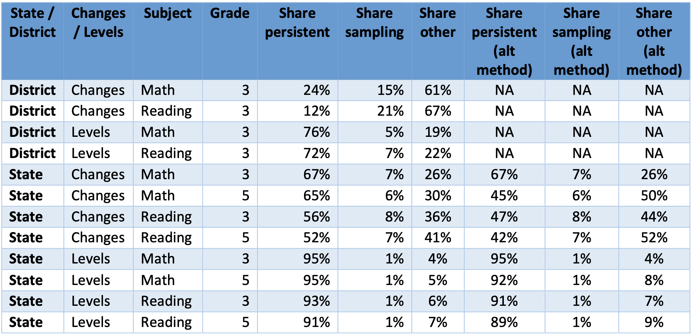

\newpage
# Appendix

## Variance Decomposition

Figure \@ref(fig:variance) below presents results from the analysis of ASER reliability using both the correlation decay method (or favored method) and the correlation in deltas method (our alternate method). Note that estimates of the share of variance due to sampling is the same across both methods.

```{r variance, fig.align="center", echo=FALSE, fig.cap="Variance Decomposition", out.width = '80%'}

```
